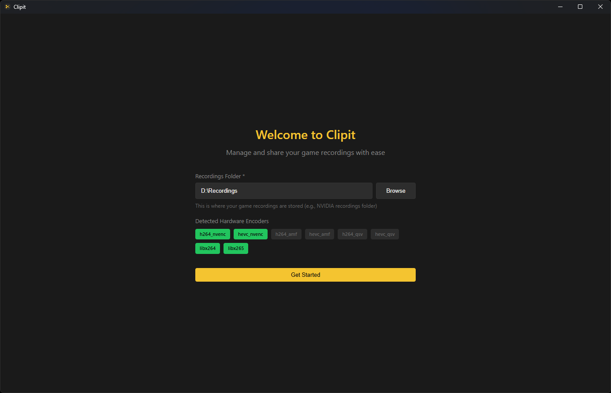
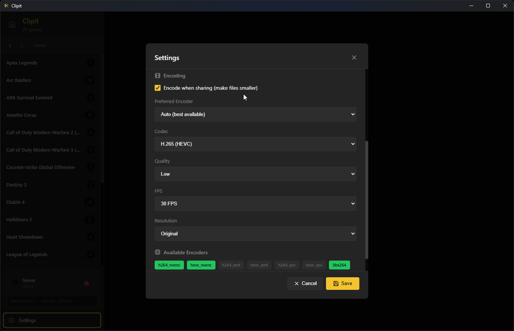
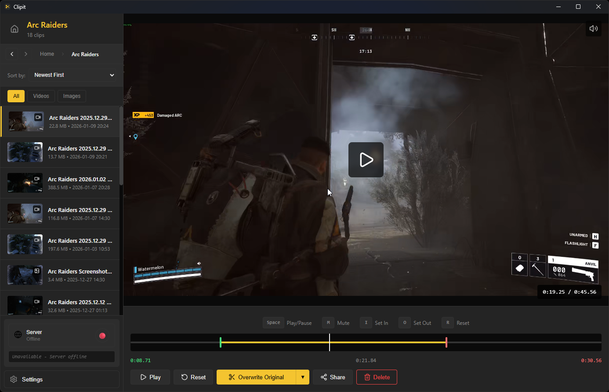
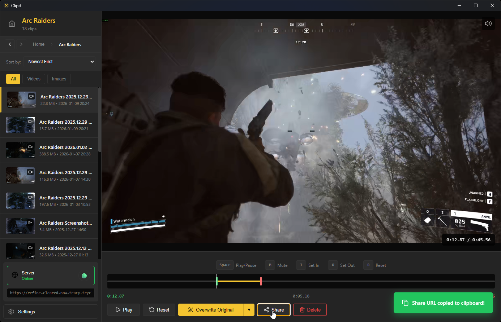

# Clipit

Desktop app for managing and sharing game clips. Organize recordings by game, trim videos, re-encode with hardware acceleration, and share via temporary public links.

<p align="center">
  
  
</p>

<p align="center">
  
  
</p>

## Features

- Browse recordings organized by game title
- Video trimming with frame-accurate preview
- Hardware-accelerated encoding (NVIDIA NVENC, AMD VCE, Intel QSV)
- Temporary public sharing with Cloudflare tunnels
- Direct video uploads to Streamable
- Auto-updates via GitHub releases
- Cross-platform (Windows, Linux)

## Installation

**[Download the latest release](https://github.com/lowbit/clipit/releases)** for your platform:

**Windows:** Run `Clipit-Setup-X.X.X.exe`
**Linux (AppImage):** `chmod +x Clipit-X.X.X.AppImage && ./Clipit-X.X.X.AppImage`
**Linux (DEB):** `sudo dpkg -i clipit_X.X.X_amd64.deb`

## Development

### Install dependencies
```bash
npm install
```

### Download required binaries
```bash
npm run download-ffmpeg
npm run download-cloudflared
```

### Run in development
```bash
npm run dev
```

### Build for production
```bash
npm run build          # Current platform
npm run build:win      # Windows only
npm run build:linux    # Linux only
```

Builds are output to `release/` directory.

## Release Procedure

```bash
# Bump version (patch/minor/major)
npm version minor

# Set token if not permanent
$env:GH_TOKEN="ghp_your_token"

# Build and publish to GitHub
npm run publish:win

# Push changes
git push && git push --tags
```

This automatically uploads:
- `Clipit-Setup-X.X.X.exe`
- `Clipit-Setup-X.X.X.exe.blockmap` (for differential updates)
- `latest.yml`

The auto-updater will detect the new version.

### GitHub Token Setup

**Temporary (current session only):**
```powershell
$env:GH_TOKEN="ghp_your_github_token"
```

**Permanent (survives restarts):**
1. Press `Win + R`, type `sysdm.cpl`
2. Environment Variables → New User Variable
3. Name: `GH_TOKEN`, Value: `ghp_your_token`
4. Restart terminal

Get token at: https://github.com/settings/tokens (requires `repo` scope)

## Tech Stack

- Electron + React + TypeScript
- FFmpeg for video processing
- Cloudflare Tunnel for sharing
- electron-builder for packaging

## License

MIT
